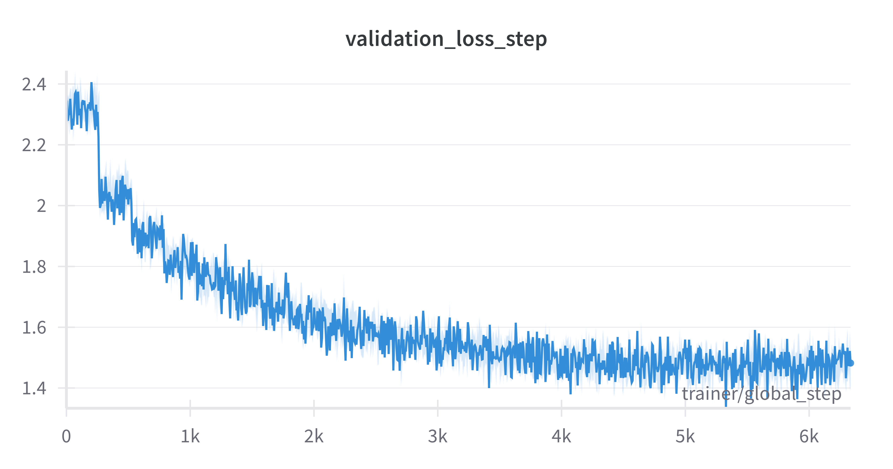
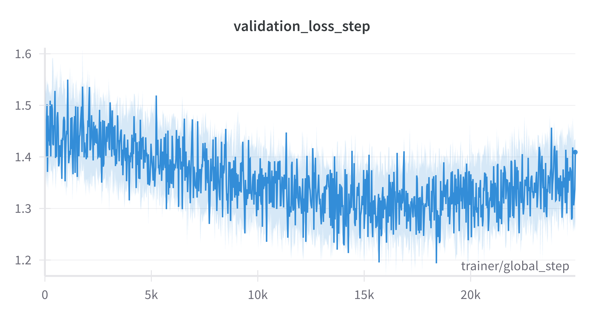

# ✨ Mini-Llama-3: A Mighty Fast Tiny Language Model! ✨🏴‍☠️

## Project Overview

In this project, I developed the code necessary to create Transformers from scratch and train them on GPUs with Compute Capability of Ampere GPUs or higher!
My project includes a lot of custom CUDA kernels, including a **highly efficient Flash-Attention 2 attention mechanism** and custom **Linear** and **Embedding** layers!
All custom layers are exposed to **Python via PyBind11**, and connected to **PyTorch**! <br />

The project also includes a Rust Tokenizer, PyTorch Lightning support and Weights & Biases visualization for training! <br />

**Key Highlights:**

*   Custom CUDA implementation of Flash Attention 2 (forward and backward pass)
*   Custom CUDA linear layer implementation (forward and backward pass)
*   Rust-based tokenizer for efficient text processing & faster BPE training
*   End-to-end training pipeline using PyTorch Lightning and Weights & Biases
*   LLM serving API supported with Azure VMs, Docker & Fast API!

Here is the website where you can try out the models if you might be interested! <a href="https://www.blackbeard-shanty.com">www.blackbeard-shanty.com</a>

## Table of Contents
1.  [Project Overview](#project-overview)
2.  [Model Details](#model-details)
3.  [CUDA Implementation](#cuda-implementation)
4.  [Rust Tokenizer](#rust-tokenizer)
5.  [Training Details](#training-details)
6.  [Weights & Biases Graphs](#weights-and-biases)
7.  [Excerpts](#excerpts)
9.  [Credits](#credits)

## 1. Model Details <a name="model-details"></a>

**Architecture:** <br /><br />
   Here's a look at the model architecture. This was heavily inspired from the Llama 3 model architectures, except I use Multi Headed attention over Grouped Query Attention.
   For a future implementation, I would love to work on CUDA kernel that runs GQA optimally! <br />

    ```
    MiniLlamaForCausalLM(
      (model): MiniLlamaModel(
        (embedding): Embedding()
        (decoder_layers): ModuleList(
          (0-3): 4 x DecoderLayer(
            (attention): MultiHeadedAttention(
              (q_proj): Linear(in_features=1024, out_features=1024)
              (k_proj): Linear(in_features=1024, out_features=1024)
              (v_proj): Linear(in_features=1024, out_features=1024)
              (o_proj): Linear(in_features=1024, out_features=1024)
              (rope): RoPEmbedding()
              (dropout): Dropout(p=0.0, inplace=False)
            )
            (attention_norm): RMSNorm()
            (mlp): MLP(
              (gate_proj): Linear(in_features=1024, out_features=4096)
              (up_proj): Linear(in_features=1024, out_features=2048)
              (down_proj): Linear(in_features=2048, out_features=1024)
              (activation_func): SwiGLU()
            )
            (input_layer_norm): RMSNorm()
            (post_attn_norm): RMSNorm()
          )
        )
        (norm): RMSNorm()
      )
      (lm_head): Linear(in_features=1024, out_features=8192)
    )
    ```
    
**Finer Details:**<br />

*   **Decoder Layers:** 4
*   **Embedding Dimensions:** 1024
*   **Attention Heads:** 4 attention heads per decoder layer, with each attention head processing 256 embedding values
*   **MLP Intermediate Dimensions**: 2048. Keep in mind, the gate projection passes through the SwiGLU activation which halves the last dimension, which is why it is provided with ```2048 x 2 out features``` when it is initialized :)
*   **Dropout:** 0.1 during training, turned off during inference!

## 2. CUDA Implementation <a name="cuda-implementation"></a>

### ⚡ Flash Attention 2
  * This section details the custom implementation of the Flash Attention 2 forward and backward pass!
  * Here is the relevant file: <a href="https://github.com/shlok191/mini-llama-3/blob/main/model/cuda/attention/attention.cu">attention implementation</a></br>
  * **Technial Details:**
    * Utilized vectorized memory loads to fetch 4 floats per memory transaction to reduce memory transfer bottleneck
    * Efficiently used 96 KB of available 100 KB of shared memory per SM by tiling 32 Q rows and 16 K, V columns per kernel
    * Carefully analyzed kernel structure to deduce where the cheaper syncwarp() can replace the costlier syncthreads() calls!
    * Prioritized cheaper warp level arithmetics over atomic operations for inter-thread operations (particularly for online softmax)</br>
  *  **Forward Pass Speedup:** 3.62 x
  *  **Backward Pass Speedup:** 4.78 x

### 🧮 Linear Layer
  * This section details the custom implementation of the Flash Attention 2 forward and backward pass!
  * Here is the relevant file: <a href="https://github.com/shlok191/mini-llama-3/blob/main/model/cuda/linear/linear.cu">linear GEMM implementation</a>
  * **Technical Details:**
    * Utilized vectorized memory loads to fetch 4 floats per memory transaction to reduce memory transfer bottleneck
    * Carried out a tiled approach to processing the output matrix in equation ```A x B = C```, calculating 64 x 64 chunks of C at a time
    * Ensured coalesced accesses for both global and shared memory to maximize cache hit rates
    * Optimized kernel performance by using Nsight Compute to identify bottlenecks and improve performance!
  *  **Forward Pass Speedup:** 0.90 x
  *  **Backward Pass Speedup:** 1.20 x
     
### 📊 Overarching CUDA Strategy

My strategy for writing the kernels was as follows!

* Attempting to minimize the shared memory bottleneck and maximize compute intensity
* Ensuring that memory accesses were always coalesced
* Trying to minimze the use of atomic operations during backward passes, instead relying on warp level operations to boost speed
* Utilizing CUDA streams to parallelize computations across multiple heads or batches
* Optimizing the kernel by analyzing it using Nsight Compute to identify bottlenecks, and doing my best to resolve them while keeping the theoretical flops of the GPU in mind!

After writing all the code that I did, I realized the amount of work that happens outside of the CUDA kernel too, and I would love to be able to hide memory transfer latency
by having highly efficient asynchronous transfers in the future! This would allow me to perform computations while transferring data, highly improving performance! :)

## 3. Rust Tokenizer <a name="rust-tokenizer"></a>

* I was always very interested in Rust! I had heard about its memory safety features making it a very good choice for safety-oriented programming in addition to its high speed.
This project gave me just the right opportunity to get my hands wet and learn more about the language!
* Here is the relevant file: <a href="https://github.com/shlok191/mini-llama-3/blob/main/model/src/tokenizers/rust_tokenizer/src/lib.rs">Rust Tokenizer</a>
* **Technical Details:**
  * Implements parallel pair frequency counting using Rayon for CPU parallelization
  * Uses custom serde serialization for efficient storage of merging operations
  * Leverages HashMaps and HashSets for O(1) token lookup and special token handling
  * Integrates with Python through PyO3 bindings while maintaining Rust's safety guarantees. Used the setuptools-rust library for this!

## 4. Training Details <a name="training-details"></a>

* I trained my model using PyTorch Lightning for LR scheduling and checkpointing. I also used Weights & Biases for monitoring!
* Here are the hyperparameters that were used:
  * Batch Size: 64
  * Embedding Dimension: 1024
  * Number of Decoder Layers: 4
  * Number of Attention Heads: 4
  * Dropout: 0.1
  * Max Training Steps: 100,000
  * Learning Rate: 1.5e-4
  * Warmup Steps: 1000
  * LR Scheduler: Cosine Annealing

### 📊 5. Weights & Biases Graphs <a name="weights-and-biases"></a>

<div style="display: flex; justify-content: center;">
   
    
</div>

## 6. Excerpts <a name = "excerpts"></a>

Here are some fun excerpts from the models, showcasing their evolution as they learned English from the original Tiny Stories dataset training!

**Vanilla Training:**

  * **Step 1500:**
    
    * **Prompt:** Once upon a time, there were two friends named Rick and Kate. Rick loved playing games and always wanted to win. Ev
      
    * **Response:** interested hills. ours rubbarr y-ady, going challenge quarters windoBingrateanswer, "Sorry bug anxiady, paddled beetle beep, herbs. bells cheerful. snake! tree. weep. dog." avoid king." pond! Binpking." can!" view interested Tytree. wasn’t Tymemories often ours sheep. grateinvestigate. younger pepperelevatorloud!" beetle meatTypaddled memories €œO"Nopond! Binavoid short. Soon, wasn’t TyTyview trees, pprobavoid pants, trees, herbs. pond! view toys.
   
 * **Step 4500:**
   
   * **Prompt:** Once upon a time, there was a little fish named Sam. Sam was a very shy fish and liked to stay away
  
   * **Response:** from the river. One day, Sam went outside to play with his friends in the garden. He saw a big fish with a ball on it and he was scared of his friends. Sam wanted to play with itDaisy. They all played together and had some fun. Sam over! said to Mia, "Thank you for being so nice. You have to be careful with you." Sam and Sam were very sad. They liked to play together. Sam thought they were fun and s.†Sam did not listen. They looked at each other and saw a big fish with a red hat. They were so excited they did not see them. The fish Together, ous fish was very happyregular Sam and marveled trunk about the fish. He

* **Step 9000:**

  * **Prompt:** I put them on. "I look like a king!" Anna laughed. She saw a dress and a scarf and put them on. "And I look
  
  * **Response:** so pretty!" Ben said. He wanted to make a king with his mom. He ran to the dress and showed her the dress. "That's a good dress, Anna," Ben said. He took the dress and reluctantly and gave it to her. Anna felt a little sad and scared. She ran planning Ben to her room. She hugged him and said, "Thank you, Ben. You are my best friend. Do you want to play with me?" Ben nodded. He liked to play with Anna and the dress. He kiss. he smiled and said, "Yes, I am a nice theater, Do you like my dress and candy?" Anna nodded. She liked Ben's dress too. She liked it and said, "Yes, I like you. But you ha
 
* **Step 21000:**

  * **Prompt:** Once upon a time, there was a little girl named Lily. She loved to play with her toys and watch car
  
  * **Response:** toons on the screen. One day, Lily's mom told her that they were going to the park to play. Lily was very excited and asked her mom if they could go to the park. Her mom said yes and they got ready to go. When they got to the park, they saw a big slide. Lily was so happy and ran to it. She played on the slide and had lots of fun. But then, the tide started to go faster and faster. Lily was scared, but her mom told her thkitchen, they could keep playing. After the tide was over, Lily's mom said it was time to go home. Lily was happy to go home and told her mom all the fun day she
 
## 7. Credits <a name = "credits"></a>

Big thanks to the following resources:

*   Flash Attention 2 Paper: [*https://arxiv.org/pdf/2307.08691*]
*   Simon Boehm's Blog on an optimal GEMM implementation in CUDA: [*https://siboehm.com/articles/22/CUDA-MMM*]
*   Microsoft Research's really interesting TinyStories Paper: [*https://arxiv.org/pdf/2305.07759*]
*   Arrr Python Package which helped me create the Python Dataset!: [*https://arrr.readthedocs.io/en/latest/index.html*]
